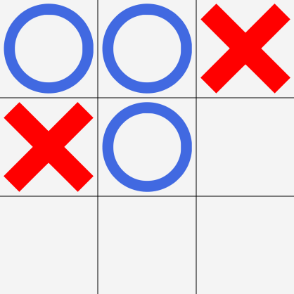

# MinMaxTicTacToe
A tictactoe ai using the minMax algo.

Containing both a tic tac toe game and to play agains ai.

The ai version is implemented using the min-max algo and should always win or end in a draw.

 
## Setup
- Clone repo and run `mvn install`
- Run `mvn javafx:run`

